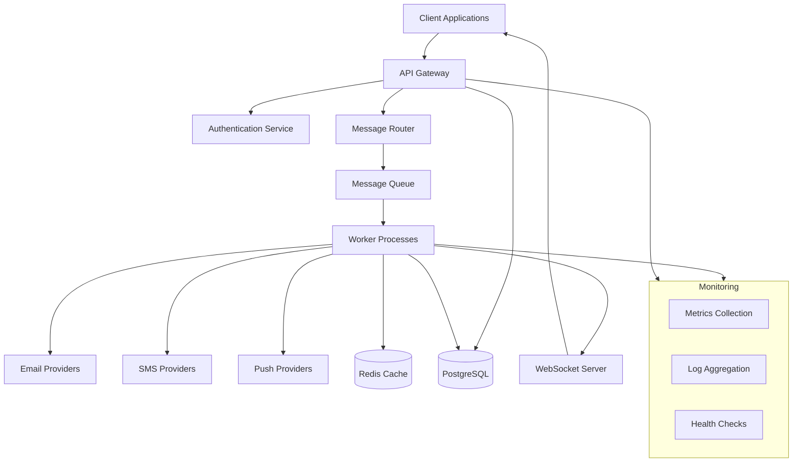
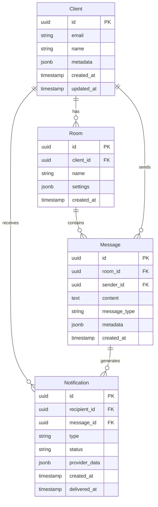

# Architecture

ChatAPI is built with a modern, scalable architecture designed to handle high-volume messaging and notifications while maintaining reliability and performance.

## System Overview



## Core Components

### 1. API Layer

The API layer provides RESTful endpoints and handles all client interactions:

**Technologies:**

- **FastAPI**: High-performance Python web framework
- **Pydantic**: Data validation and serialization
- **SQLAlchemy**: Database ORM
- **Alembic**: Database migrations

**Key Features:**

- Async/await support for high concurrency
- Automatic API documentation with OpenAPI
- Request/response validation
- Rate limiting and throttling

### 2. Authentication & Authorization

Secure API access with multiple authentication methods:

```python
# JWT-based authentication
from app.core.security import verify_token

@router.get("/protected-endpoint")
async def protected_route(
    current_user: User = Depends(get_current_user)
):
    return {"user_id": current_user.id}
```

**Features:**

- JWT token-based authentication
- API key authentication
- Role-based access control (RBAC)
- Rate limiting per user/API key

### 3. Message Queue System

Asynchronous message processing using Celery with Redis:

```python
# Message queue configuration
from celery import Celery

app = Celery(
    'chatapi',
    broker='redis://localhost:6379/0',
    backend='redis://localhost:6379/0'
)

@app.task(bind=True, max_retries=3)
def send_notification(self, notification_data):
    try:
        # Process notification
        provider = get_provider(notification_data['type'])
        result = provider.send(notification_data)
        return result
    except Exception as exc:
        # Retry with exponential backoff
        raise self.retry(exc=exc, countdown=60 * (2 ** self.request.retries))
```

**Benefits:**

- Horizontal scaling of workers
- Automatic retry with exponential backoff
- Priority queues for urgent messages
- Dead letter queue for failed messages

### 4. Provider Abstraction

Unified interface for multiple notification providers:

```python
from abc import ABC, abstractmethod

class NotificationProvider(ABC):
    @abstractmethod
    async def send(self, message: Message) -> DeliveryResult:
        pass

    @abstractmethod
    async def get_status(self, message_id: str) -> MessageStatus:
        pass

class EmailProvider(NotificationProvider):
    def __init__(self, smtp_config: SMTPConfig):
        self.client = SMTPClient(smtp_config)

    async def send(self, message: Message) -> DeliveryResult:
        return await self.client.send_email(message)
```

## Database Architecture

### Schema Design



### Data Partitioning

Large tables are partitioned for performance:

```sql
-- Partition messages by month
CREATE TABLE messages_2023_12 PARTITION OF messages
FOR VALUES FROM ('2023-12-01') TO ('2024-01-01');

-- Partition notifications by status and date
CREATE TABLE notifications_delivered_2023_12 PARTITION OF notifications
FOR VALUES IN ('delivered') FROM ('2023-12-01') TO ('2024-01-01');
```

## Scalability Patterns

### Horizontal Scaling

**API Servers:**

- Stateless application servers
- Load balancing with health checks
- Auto-scaling based on CPU/memory usage

**Worker Processes:**

- Multiple worker types for different notification channels
- Queue-based load distribution
- Independent scaling per notification type

**Database:**

- Read replicas for query distribution
- Connection pooling
- Query optimization and indexing

### Caching Strategy

```python
# Multi-layer caching
class CacheManager:
    def __init__(self):
        self.redis = RedisClient()
        self.local_cache = LRUCache(maxsize=1000)

    async def get_client(self, client_id: str) -> Optional[Client]:
        # L1: Local cache
        if client := self.local_cache.get(client_id):
            return client

        # L2: Redis cache
        if client_data := await self.redis.get(f"client:{client_id}"):
            client = Client.parse_raw(client_data)
            self.local_cache[client_id] = client
            return client

        # L3: Database
        client = await db.get_client(client_id)
        if client:
            await self.redis.setex(
                f"client:{client_id}",
                3600,
                client.json()
            )
            self.local_cache[client_id] = client

        return client
```

## Security Architecture

### Network Security

```yaml
# Security layers
Internet --> WAF --> Load Balancer --> API Gateway --> Application

WAF:
  - DDoS protection
  - SQL injection prevention
  - XSS filtering
  - Rate limiting

Load Balancer:
  - SSL termination
  - Health checks
  - Geographic routing

API Gateway:
  - Authentication
  - Authorization
  - Request validation
  - Response filtering
```

### Data Protection

**Encryption:**

- TLS 1.3 for data in transit
- AES-256 for data at rest
- Key rotation policies
- HSM for key management

**Privacy:**

- PII encryption in database
- Data anonymization for analytics
- GDPR compliance features
- Audit logging

## Monitoring & Observability

### Metrics Collection

```python
from prometheus_client import Counter, Histogram, Gauge

# Application metrics
notification_counter = Counter(
    'notifications_sent_total',
    'Total notifications sent',
    ['type', 'provider', 'status']
)

response_time = Histogram(
    'api_request_duration_seconds',
    'API request duration',
    ['method', 'endpoint']
)

active_connections = Gauge(
    'websocket_connections_active',
    'Active WebSocket connections'
)
```

### Distributed Tracing

```python
from opentelemetry import trace

tracer = trace.get_tracer(__name__)

async def send_notification(notification_data):
    with tracer.start_as_current_span("send_notification") as span:
        span.set_attribute("notification.type", notification_data["type"])
        span.set_attribute("notification.provider", notification_data["provider"])

        # Process notification with tracing
        result = await process_notification(notification_data)

        span.set_attribute("notification.status", result.status)
        return result
```

### Health Checks

```python
@router.get("/health")
async def health_check():
    checks = {
        "database": await check_database_connection(),
        "redis": await check_redis_connection(),
        "queue": await check_queue_connection(),
        "providers": await check_provider_health()
    }

    status = "healthy" if all(checks.values()) else "unhealthy"
    return {
        "status": status,
        "checks": checks,
        "timestamp": datetime.utcnow()
    }
```

## Deployment Architecture

### Container Orchestration

```yaml
# Kubernetes deployment
apiVersion: apps/v1
kind: Deployment
metadata:
  name: chatapi
spec:
  replicas: 3
  selector:
    matchLabels:
      app: chatapi
  template:
    metadata:
      labels:
        app: chatapi
    spec:
      containers:
        - name: api
          image: chatapi:latest
          ports:
            - containerPort: 8000
          env:
            - name: DATABASE_URL
              valueFrom:
                secretKeyRef:
                  name: chatapi-secrets
                  key: database-url
          resources:
            requests:
              memory: "256Mi"
              cpu: "250m"
            limits:
              memory: "512Mi"
              cpu: "500m"
```

### Infrastructure as Code

```terraform
# Terraform configuration
resource "aws_ecs_cluster" "chatapi" {
  name = "chatapi-cluster"

  capacity_providers = ["FARGATE", "FARGATE_SPOT"]

  default_capacity_provider_strategy {
    capacity_provider = "FARGATE"
    weight           = 1
  }
}

resource "aws_ecs_service" "api" {
  name            = "chatapi-api"
  cluster         = aws_ecs_cluster.chatapi.id
  task_definition = aws_ecs_task_definition.api.arn
  desired_count   = 3

  load_balancer {
    target_group_arn = aws_lb_target_group.api.arn
    container_name   = "api"
    container_port   = 8000
  }
}
```

## Performance Considerations

### Database Optimization

- **Indexing Strategy**: Composite indexes on frequently queried columns
- **Query Optimization**: Use of query plans and performance analysis
- **Connection Pooling**: Efficient database connection management
- **Read Replicas**: Distribute read traffic across multiple replicas

### API Performance

- **Async Processing**: Non-blocking I/O for high concurrency
- **Response Caching**: Cache frequently requested data
- **Pagination**: Limit response sizes for large datasets
- **Compression**: Gzip compression for API responses

### Worker Optimization

- **Batching**: Process multiple notifications in batches
- **Parallel Processing**: Concurrent worker processes
- **Provider Optimization**: Connection pooling for external APIs
- **Retry Logic**: Intelligent retry strategies with circuit breakers

## Future Architecture Plans

### Planned Enhancements

1. **Event Sourcing**: Implement event-driven architecture
2. **CQRS**: Separate read and write models
3. **Microservices**: Break down into smaller, focused services
4. **Multi-tenancy**: Enhanced isolation for enterprise customers
5. **Global Distribution**: Multi-region deployment capabilities
