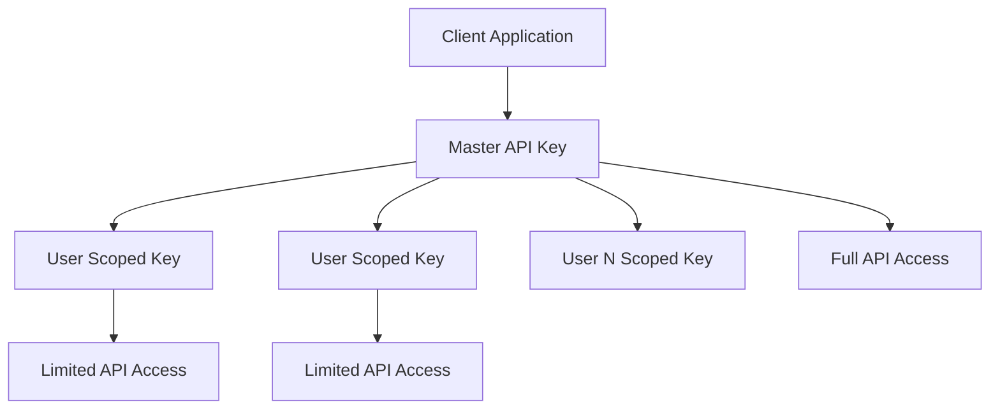

# Authentication Guide

ChatAPI uses a sophisticated dual-key authentication system designed for client applications that manage multiple users while maintaining security and simplicity.

## Authentication Overview

### Dual-Key Architecture

ChatAPI implements a two-tier authentication system:

1. **Master API Key** - Used by client applications to authenticate with the API
2. **Scoped API Keys** - User-specific keys generated for individual users within a client application



## Security Features

### Always-Rotate on Login

- Every user login automatically generates a new API key
- Previous API key is immediately revoked
- Prevents accumulation of stale or potentially compromised keys

### Automatic Key Cleanup

- No manual key management required
- Clear security events for every authentication action
- Simplified frontend logic

### Permission-Based Access

- Granular control over what users can do
- Master keys for administrative operations
- Scoped keys for user-specific actions

## Getting Started

### 1. Client Registration

First, register your client application to get a master API key:

```bash
POST /api/v1/clients
Content-Type: application/json

{
  "name": "My Chat App",
  "description": "Customer support chat system"
}
```

**Response:**

```json
{
	"id": "550e8400-e29b-41d4-a716-446655440000",
	"name": "My Chat App",
	"description": "Customer support chat system",
	"master_api_key": "ck_live_abc123...",
	"is_active": true,
	"created_at": "2024-01-01T00:00:00Z"
}
```

!!! danger "Store Master Key Securely"
The master API key is shown only once. Store it securely in your application's environment variables or secret management system.

### 2. User Registration

Register users within your client application:

```bash
POST /api/v1/users
Authorization: Bearer ck_live_abc123...
Content-Type: application/json

{
  "email": "john@example.com",
  "username": "john_doe",
  "full_name": "John Doe"
}
```

**Response:**

```json
{
	"id": "user-uuid-here",
	"email": "john@example.com",
	"username": "john_doe",
	"full_name": "John Doe",
	"scoped_api_key": "sk_user_def456...",
	"is_active": true,
	"created_at": "2024-01-01T00:00:00Z"
}
```

### 3. User Login (Key Rotation)

When a user logs in, always call the login endpoint to get a fresh API key:

```bash
POST /api/v1/users/login
Authorization: Bearer ck_live_abc123...
Content-Type: application/json

{
  "email": "john@example.com"
}
```

**Response:**

```json
{
	"user": {
		"id": "user-uuid-here",
		"email": "john@example.com",
		"username": "john_doe",
		"full_name": "John Doe",
		"is_active": true
	},
	"scoped_api_key": "sk_user_xyz789...",
	"expires_at": "2024-01-08T00:00:00Z"
}
```

!!! note "Automatic Key Rotation"
The previous `scoped_api_key` is automatically revoked when a new one is issued.

## Using API Keys

### Master API Key Usage

Use the master API key for administrative operations:

```bash
# Managing users
GET /api/v1/users
Authorization: Bearer ck_live_abc123...

# Managing rooms
GET /api/v1/rooms/all
Authorization: Bearer ck_live_abc123...

# System operations
POST /api/v1/notifications
Authorization: Bearer ck_live_abc123...
```

### Scoped API Key Usage

Use scoped API keys for user-specific operations:

```bash
# User sending messages
POST /api/v1/messages
Authorization: Bearer sk_user_xyz789...

# User joining rooms
POST /api/v1/rooms/join
Authorization: Bearer sk_user_xyz789...

# User profile updates
PUT /api/v1/users/profile
Authorization: Bearer sk_user_xyz789...
```

## Permission Levels

### Master Key Permissions

Master API keys can perform all operations:

- ✅ Create and manage users
- ✅ Create and manage rooms
- ✅ Send notifications
- ✅ View all client data
- ✅ Manage webhooks
- ✅ Access analytics

### Scoped Key Permissions

Scoped API keys have limited permissions:

- ✅ Send messages in joined rooms
- ✅ Join/leave rooms
- ✅ Update own profile
- ✅ View own data
- ❌ Create/delete users
- ❌ Manage client settings
- ❌ Access other users' data

## Integration Examples

### Frontend Integration

```javascript
class ChatAPIClient {
	constructor(masterKey) {
		this.masterKey = masterKey;
		this.baseURL = "http://localhost:8000/api/v1";
	}

	// Admin function - uses master key
	async createUser(userData) {
		const response = await fetch(`${this.baseURL}/users`, {
			method: "POST",
			headers: {
				Authorization: `Bearer ${this.masterKey}`,
				"Content-Type": "application/json",
			},
			body: JSON.stringify(userData),
		});
		return response.json();
	}

	// User login - returns scoped key
	async loginUser(email) {
		const response = await fetch(`${this.baseURL}/users/login`, {
			method: "POST",
			headers: {
				Authorization: `Bearer ${this.masterKey}`,
				"Content-Type": "application/json",
			},
			body: JSON.stringify({ email }),
		});
		return response.json();
	}

	// User action - uses scoped key
	async sendMessage(userKey, messageData) {
		const response = await fetch(`${this.baseURL}/messages`, {
			method: "POST",
			headers: {
				Authorization: `Bearer ${userKey}`,
				"Content-Type": "application/json",
			},
			body: JSON.stringify(messageData),
		});
		return response.json();
	}
}

// Usage
const client = new ChatAPIClient("ck_live_abc123...");

// Create a user (admin operation)
const newUser = await client.createUser({
	email: "user@example.com",
	username: "user123",
	full_name: "User Name",
});

// User login (get fresh scoped key)
const loginResult = await client.loginUser("user@example.com");
const userKey = loginResult.scoped_api_key;

// User sends message (user operation)
await client.sendMessage(userKey, {
	room_id: "room-uuid",
	content: "Hello, world!",
	message_type: "text",
});
```

### Backend Integration

```python
import httpx
from typing import Optional

class ChatAPIClient:
    def __init__(self, master_key: str, base_url: str = "http://localhost:8000/api/v1"):
        self.master_key = master_key
        self.base_url = base_url

    async def create_user(self, user_data: dict) -> dict:
        """Create a new user (admin operation)"""
        async with httpx.AsyncClient() as client:
            response = await client.post(
                f"{self.base_url}/users",
                headers={"Authorization": f"Bearer {self.master_key}"},
                json=user_data
            )
            return response.json()

    async def login_user(self, email: str) -> dict:
        """Login user and get fresh scoped key"""
        async with httpx.AsyncClient() as client:
            response = await client.post(
                f"{self.base_url}/users/login",
                headers={"Authorization": f"Bearer {self.master_key}"},
                json={"email": email}
            )
            return response.json()

    async def send_message(self, user_key: str, message_data: dict) -> dict:
        """Send message using user's scoped key"""
        async with httpx.AsyncClient() as client:
            response = await client.post(
                f"{self.base_url}/messages",
                headers={"Authorization": f"Bearer {user_key}"},
                json=message_data
            )
            return response.json()

# Usage
client = ChatAPIClient("ck_live_abc123...")

# Admin creates user
user = await client.create_user({
    "email": "user@example.com",
    "username": "user123",
    "full_name": "User Name"
})

# User login
login_result = await client.login_user("user@example.com")
user_key = login_result["scoped_api_key"]

# User sends message
await client.send_message(user_key, {
    "room_id": "room-uuid",
    "content": "Hello from Python!",
    "message_type": "text"
})
```

## Security Best Practices

### Key Storage

**✅ Do:**

- Store master keys in environment variables
- Use secure secret management systems
- Encrypt keys at rest
- Rotate master keys periodically

**❌ Don't:**

- Hardcode keys in source code
- Store keys in version control
- Log keys in application logs
- Share keys in insecure channels

### Key Usage

**✅ Do:**

- Use HTTPS in production
- Implement proper error handling
- Validate key permissions
- Monitor for unusual activity

**❌ Don't:**

- Send keys in URL parameters
- Use keys in client-side JavaScript (except scoped keys)
- Cache keys indefinitely
- Ignore authentication errors

### Frontend Security

```javascript
// ✅ Good - Store user key temporarily
localStorage.setItem("chatapi_user_key", userKey);

// ❌ Bad - Never store master key in frontend
localStorage.setItem("chatapi_master_key", masterKey); // DON'T DO THIS

// ✅ Good - Clear keys on logout
function logout() {
	localStorage.removeItem("chatapi_user_key");
	// Optionally call logout endpoint to revoke key
}
```

## Error Handling

### Common Authentication Errors

```json
// Invalid API key
{
  "detail": "Invalid authentication credentials",
  "error_code": "INVALID_CREDENTIALS",
  "status_code": 401
}

// Expired key
{
  "detail": "API key has expired",
  "error_code": "KEY_EXPIRED",
  "status_code": 401
}

// Insufficient permissions
{
  "detail": "Insufficient permissions for this operation",
  "error_code": "INSUFFICIENT_PERMISSIONS",
  "status_code": 403
}
```

### Handling Authentication Errors

```javascript
async function makeAuthenticatedRequest(url, options) {
	try {
		const response = await fetch(url, options);

		if (response.status === 401) {
			// Key expired or invalid - trigger re-login
			await handleReLogin();
			throw new Error("Authentication required");
		}

		if (response.status === 403) {
			// Insufficient permissions
			throw new Error("Access denied");
		}

		return response.json();
	} catch (error) {
		console.error("Request failed:", error);
		throw error;
	}
}
```

## Next Steps

Now that you understand authentication:

1. **[API Overview](../api/overview.md)** - Explore available endpoints
2. **[Room Management](../api/rooms.md)** - Create and manage chat rooms
3. **[Messages](../api/messages.md)** - Send and receive messages
4. **[WebSockets](../api/websockets.md)** - Real-time communication

## Additional Resources

- **[API Reference](../reference/api-spec.md)** - Complete API specification
- **[Error Codes](../reference/error-codes.md)** - All error codes and meanings
- **[Security Guidelines](../deployment/production.md#security)** - Production security checklist
