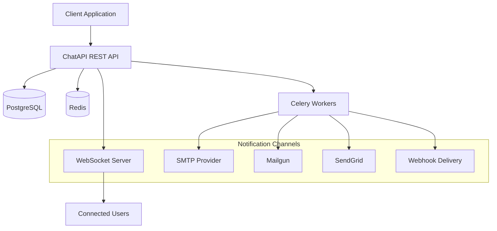

# ChatAPI Documentation

Welcome to ChatAPI - an open-source, high-performance messaging and notifications API service designed for modern applications.

## 🚀 What is ChatAPI?

ChatAPI is a powerful backend service that provides:

- **Real-time messaging** with room-based architecture
- **Multi-channel notifications** (Email, WebSocket, Webhooks)
- **Client-configurable providers** for email delivery
- **WebSocket communication** with automatic fallback
- **Production-ready** with Docker and background processing

## ✨ Key Features

### 🔄 Pure Relay Model

ChatAPI acts as a relay service - you provide ready-to-send content, and we guarantee delivery across multiple channels.

### 🏢 Multi-tenant Architecture

Each client application gets isolated data and configuration while sharing the robust infrastructure.

### 📧 Email Provider Flexibility

Support for SMTP, Mailgun, SendGrid, Postmark, AWS SES with client-specific configuration.

### 🔌 WebSocket Real-time

Built-in WebSocket support with room management and automatic notification delivery.

### 🎯 Background Processing

Reliable message delivery with Celery and Redis for background job processing.

## 🎯 Perfect For

- **Customer support systems** with real-time chat
- **E-commerce platforms** needing order notifications
- **SaaS applications** requiring user communication
- **Multi-tenant applications** with isolated messaging
- **Notification-heavy apps** needing reliable delivery

## 🏗️ Architecture Overview



## 🚀 Quick Start

### 1. Start with Docker Hub Image

Create a `docker-compose.yml` file:

```yaml
version: "3.8"
services:
  chatapi:
    image: chatapi/chatapi:0.0.1
    ports:
      - "8000:8000"
    environment:
      - DATABASE_URL=postgresql://chatapi:password@db:5432/chatapi
      - REDIS_URL=redis://redis:6379/0
      - SECRET_KEY=your-secret-key-here
    depends_on: [db, redis]

  db:
    image: postgres:12
    environment:
      POSTGRES_DB: chatapi
      POSTGRES_USER: chatapi
      POSTGRES_PASSWORD: password
    volumes: [postgres_data:/var/lib/postgresql/data]

  redis:
    image: redis:7-alpine
    volumes: [redis_data:/data]

volumes:
  postgres_data:
  redis_data:
```

```bash
docker-compose up -d
```

### 2. Create a Client

```bash
curl -X POST http://localhost:8000/api/v1/clients \
  -H "Content-Type: application/json" \
  -d '{"name": "My App"}'
```

### 3. Send Your First Notification

```bash
curl -X POST http://localhost:8000/api/v1/notifications \
  -H "Authorization: Bearer YOUR_API_KEY" \
  -H "Content-Type: application/json" \
  -d '{
    "type": "email",
    "to_email": "user@example.com",
    "subject": "Welcome!",
    "content": "<h1>Welcome to our platform!</h1>",
    "email_fallback": {
      "enabled": true
    }
  }'
```

## 📚 Documentation Sections

### [Getting Started](getting-started/quick-start.md)

Learn how to set up and configure ChatAPI for your application.

### [API Guide](api/overview.md)

Complete reference for all API endpoints and their usage.

### [Notifications](notifications/overview.md)

Deep dive into the notification system and provider configuration.

### [Development](development/setup.md)

Guide for contributors and developers working on ChatAPI.

### [Deployment](deployment/docker.md)

Production deployment guides and best practices.

## 🔗 Links

- **[GitHub Repository](https://github.com/Byabasaija/chatapi)**
- **[API Documentation](api/overview.md)**
- **[Docker Hub](https://hub.docker.com/r/chatapi/chatapi)**
- **[Issue Tracker](https://github.com/Byabasaija/chatapi/issues)**

## 🤝 Contributing

We welcome contributions! Check out our [Contributing Guide](development/contributing.md) to get started.

## 📄 License

ChatAPI is released under the [MIT License](https://github.com/Byabasaija/chatapi/blob/main/LICENSE).
