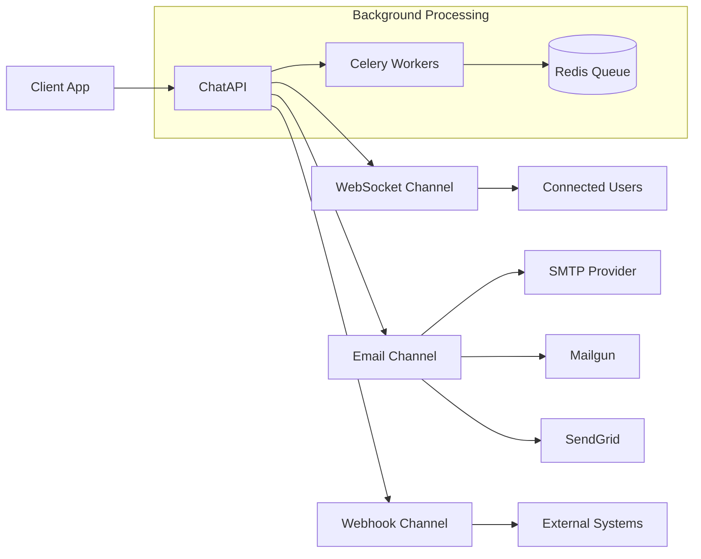
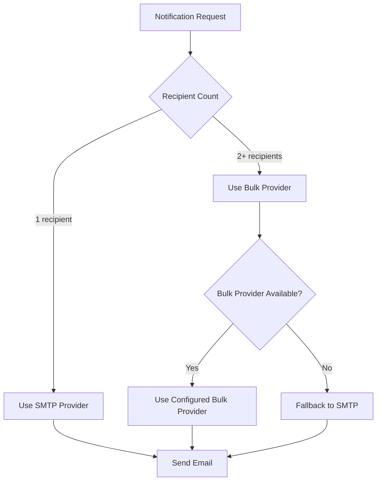

# Notifications Overview

ChatAPI's notification system is designed around a **pure relay model** - you provide ready-to-send content, and we guarantee delivery across multiple channels with tracking, retries, and analytics.

## 🎯 Core Philosophy

### Pure Relay Model

ChatAPI doesn't manage templates, content generation, or personalization. Instead:

- **You own the content** - Send fully-formed emails, messages, and notifications
- **We guarantee delivery** - Multi-channel delivery with automatic failover
- **Complete tracking** - Real-time status updates and delivery analytics
- **Provider abstraction** - Switch email providers without code changes

### Value Proposition

> **"We don't manage your content - we guarantee it gets delivered."**

## 🔄 Multi-Channel Architecture



## 📡 Supported Channels

### WebSocket Notifications

Real-time in-app notifications delivered instantly to connected users.

- ✅ Instant delivery to online users
- ✅ Room-based targeting
- ✅ Automatic fallback to email for offline users
- ✅ Message queuing for reconnection

### Email Notifications

Reliable email delivery with multiple provider support.

- ✅ SMTP for transactional emails (1 recipient)
- ✅ Bulk providers for mass emails (2+ recipients)
- ✅ Automatic provider selection based on recipient count
- ✅ Delivery tracking and bounce handling

### Webhook Notifications

Forward notifications to external systems for maximum flexibility.

- ✅ Reliable webhook delivery with retries
- ✅ Signature verification for security
- ✅ Configurable timeout and retry policies
- ✅ Delivery attempt tracking

## 🚀 Quick Start

### Basic Notification

Send a simple notification:

```bash
curl -X POST http://localhost:8000/api/v1/notifications \
  -H "Authorization: Bearer YOUR_API_KEY" \
  -H "Content-Type: application/json" \
  -d '{
    "type": "email",
    "to_email": "user@example.com",
    "subject": "Welcome to our platform!",
    "content": "<h1>Welcome!</h1><p>Your account is now active.</p>",
    "email_fallback": {
      "enabled": true
    }
  }'
```

### Multi-Channel Notification

Send the same notification via multiple channels:

```bash
curl -X POST http://localhost:8000/api/v1/notifications \
  -H "Authorization: Bearer YOUR_API_KEY" \
  -H "Content-Type: application/json" \
  -d '{
    "type": "websocket",
    "room_id": "room-uuid-here",
    "subject": "New Order Received",
    "content": "Your order #12345 has been confirmed and is being processed.",
    "email_fallback": {
      "enabled": true,
      "to_email": "customer@example.com",
      "subject": "Order Confirmation #12345",
      "content": "<h1>Order Confirmed</h1><p>Thank you for your order!</p>"
    }
  }'
```

## 🔧 Provider Configuration

### Email Provider Types

ChatAPI supports multiple email providers with automatic selection:

#### Transactional Providers (1 recipient)

- **SMTP** - Direct SMTP server connection
- Ideal for: Password resets, welcome emails, receipts

#### Bulk Providers (2+ recipients)

- **Mailgun** - Mailgun API for bulk delivery
- **SendGrid** - SendGrid API for marketing emails
- **Postmark** - Postmark for transactional bulk
- **AWS SES** - Amazon Simple Email Service

### Provider Selection Logic



### Configure Email Providers

Set up your email providers via API:

```bash
# Configure SMTP (transactional)
curl -X PUT http://localhost:8000/api/v1/clients/email-providers \
  -H "Authorization: Bearer YOUR_API_KEY" \
  -H "Content-Type: application/json" \
  -d '{
    "provider_config": {
      "provider_type": "smtp",
      "host": "smtp.gmail.com",
      "port": 587,
      "username": "your-email@gmail.com",
      "password": "your-app-password",
      "use_tls": true
    },
    "is_primary": true,
    "default_from_email": "noreply@yourapp.com",
    "default_from_name": "Your App"
  }'

# Configure Mailgun (bulk)
curl -X PUT http://localhost:8000/api/v1/clients/email-providers \
  -H "Authorization: Bearer YOUR_API_KEY" \
  -H "Content-Type: application/json" \
  -d '{
    "provider_config": {
      "provider_type": "mailgun",
      "api_key": "key-1234567890abcdef",
      "domain": "mg.yourapp.com"
    },
    "is_bulk": true,
    "default_from_email": "newsletter@yourapp.com",
    "default_from_name": "Your App Newsletter"
  }'
```

## 📊 Delivery Tracking

### Real-time Status Updates

Track notification delivery in real-time:

```bash
# Get notification status
curl http://localhost:8000/api/v1/notifications/notification-id \
  -H "Authorization: Bearer YOUR_API_KEY"
```

**Response:**

```json
{
	"id": "notification-uuid",
	"status": "sent",
	"type": "email",
	"subject": "Welcome!",
	"created_at": "2024-01-01T10:00:00Z",
	"sent_at": "2024-01-01T10:00:05Z",
	"delivery_attempts": [
		{
			"attempt_number": 1,
			"status": "success",
			"provider_name": "smtp",
			"attempted_at": "2024-01-01T10:00:05Z",
			"response_time_ms": 1250
		}
	]
}
```

### Delivery Statuses

| Status       | Description                        |
| ------------ | ---------------------------------- |
| `pending`    | Notification queued for processing |
| `processing` | Currently being sent               |
| `sent`       | Successfully delivered             |
| `failed`     | All delivery attempts failed       |
| `retrying`   | Retrying after temporary failure   |
| `cancelled`  | Manually cancelled                 |

## 🔄 Automatic Fallback

### WebSocket → Email Fallback

When sending WebSocket notifications, ChatAPI automatically falls back to email for offline users:

```json
{
	"type": "websocket",
	"room_id": "support-room-123",
	"subject": "New Support Ticket",
	"content": "A new support ticket has been created.",
	"email_fallback": {
		"enabled": true,
		"to_email": "support@yourapp.com",
		"subject": "New Support Ticket - WebSocket Fallback",
		"content": "<h2>New Support Ticket</h2><p>A customer has submitted a new support ticket.</p>"
	}
}
```

### Retry Logic

Failed notifications are automatically retried with exponential backoff:

- **Attempt 1**: Immediate
- **Attempt 2**: 30 seconds later
- **Attempt 3**: 2 minutes later
- **Attempt 4**: 5 minutes later (final attempt)

## 📈 Analytics & Monitoring

### Delivery Analytics

Track notification performance:

```bash
# Get delivery statistics
curl http://localhost:8000/api/v1/notifications/analytics \
  -H "Authorization: Bearer YOUR_API_KEY" \
  -G \
  -d "start_date=2024-01-01" \
  -d "end_date=2024-01-31"
```

**Response:**

```json
{
	"total_notifications": 1500,
	"successful_deliveries": 1435,
	"failed_deliveries": 65,
	"success_rate": 95.67,
	"by_channel": {
		"email": {
			"total": 800,
			"successful": 785,
			"failed": 15,
			"success_rate": 98.13
		},
		"websocket": {
			"total": 600,
			"successful": 550,
			"failed": 50,
			"success_rate": 91.67
		},
		"webhook": {
			"total": 100,
			"successful": 100,
			"failed": 0,
			"success_rate": 100.0
		}
	}
}
```

## 🎨 Use Cases

### E-commerce Order Flow

```javascript
// Order confirmation with multi-channel delivery
const orderNotification = {
	type: "websocket",
	room_id: customer.room_id,
	subject: "Order Confirmed",
	content: `Your order #${order.id} has been confirmed!`,
	email_fallback: {
		enabled: true,
		to_email: customer.email,
		subject: `Order Confirmation #${order.id}`,
		content: `
      <h1>Thank you for your order!</h1>
      <p>Order #${order.id} has been confirmed and will be shipped soon.</p>
      <p>Total: $${order.total}</p>
    `,
	},
};

await chatAPI.sendNotification(orderNotification);
```

### Customer Support System

```javascript
// New ticket notification to support team
const supportNotification = {
	type: "email",
	to_email: "support@company.com",
	subject: `New Support Ticket from ${customer.name}`,
	content: `
    <h2>New Support Ticket</h2>
    <p><strong>Customer:</strong> ${customer.name}</p>
    <p><strong>Email:</strong> ${customer.email}</p>
    <p><strong>Issue:</strong> ${ticket.subject}</p>
    <p><strong>Description:</strong></p>
    <p>${ticket.description}</p>
  `,
};

await chatAPI.sendNotification(supportNotification);
```

### Marketing Campaign

```javascript
// Bulk email to subscribers
const campaignNotification = {
	type: "email",
	to_email: subscribers.map((s) => s.email), // Array for bulk
	subject: "🎉 Special Offer - Limited Time Only!",
	content: `
    <h1>Exclusive 50% Off Sale!</h1>
    <p>Don't miss out on our biggest sale of the year.</p>
    <a href="${campaignLink}">Shop Now</a>
  `,
};

await chatAPI.sendNotification(campaignNotification);
```

## 🔗 Related Documentation

- **[Email Providers](email-providers.md)** - Detailed provider configuration
- **[WebSocket Delivery](websocket-delivery.md)** - Real-time notification setup
- **[Provider Configuration](provider-configuration.md)** - Advanced provider settings
- **[Delivery Tracking](delivery-tracking.md)** - Monitoring and analytics
- **[API Reference](../api/notifications.md)** - Complete API documentation

## 🚀 Next Steps

1. **[Set up email providers](email-providers.md)** for reliable email delivery
2. **[Configure WebSocket delivery](websocket-delivery.md)** for real-time notifications
3. **[Implement delivery tracking](delivery-tracking.md)** for monitoring
4. **[Explore the API](../api/notifications.md)** for advanced features
